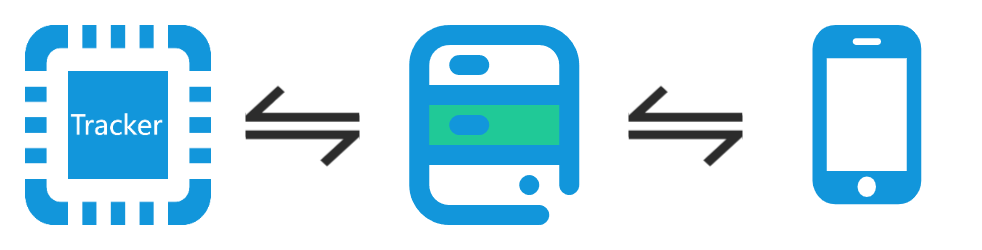
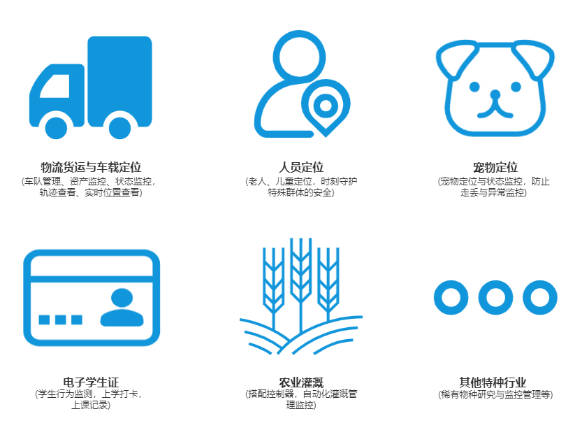
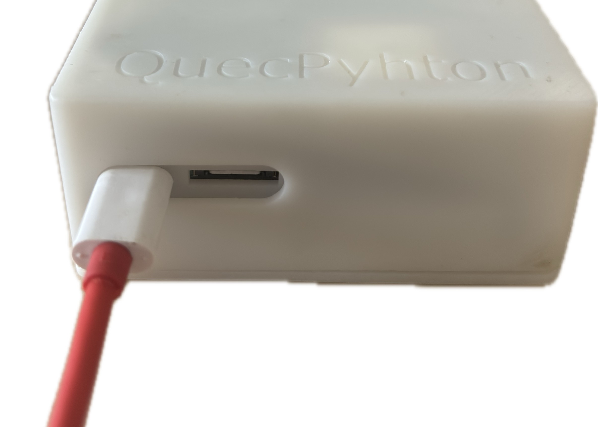

# Smart Tracker Solution

Welcome to the QuecPython Tracker Solution repository! This repository provides a comprehensive solution for using the QuecPython Tracker device application.

## Introduction

Smart Tracker is a hardware device developed by QuecPython specifically for rapid demonstrations and smart asset management. It is based on the QuecPython **EG912U** module, supports multiple communication modules, and possesses powerful sensor expansion capabilities. It is your ideal entry point for exploring the Acceleronix Asset Management SaaS platform.

### Product Overview

- Tracker Smart Locator
- Terminal device functions cover most locator application scenarios
- Visual operation platform + mobile APP for easier device management and data viewing



### Product Features

- Intelligent perception, identification, and reporting of location information and hazardous alerts
- QuecPython secondary development, modular, customizable, shortening the development cycle
- Visual operation platform and mobile APP for terminal control

### Application Industries

- Vehicle Positioning
- Logistics and Freight
- Personnel Positioning
- Electronic Student ID
- Pet Tracking
- Special Industries (e.g., Agricultural Irrigation, Rare Species Monitoring, etc.)



## Features

- Multiple Positioning Methods, Safe Fencing, Hazard Alarms, Emergency SOS, Voice Monitoring, Recording, Track Playback, Remote Control, etc.
- Intelligent Positioning
  - The system utilizes technologies like 4G communication, multiple positioning methods, and distributed services to provide an end-to-service one-stop solution for the smart locator industry.
- Full Platform Support
  - The device operation platform and mobile APP are fully functional, allowing terminal device manufacturers to quickly manage devices and end-users without building their own service platform.
- Reliable and Stable
  - Terminal devices feature high positioning accuracy, high hazard perception sensitivity, low power consumption, and stable operation. Manufacturers can use them out-of-the-box, significantly shortening the hardware development cycle.


## Quick Start

### Prerequisites

Before you begin, ensure you have the following prerequisites:

- **Hardware:**
  - A Windows computer, recommended `Win10` system
  - A set of Tracker box products
    > Purchase Channel: Contact Quectel staff for purchase
  - A normally functioning SIM card

- **Software:**
  - USB driver for the QuecPython module: [QuecPython_USB_Driver_Win10_U_G](https://developer.quectel.com/wp-content/uploads/2024/09/Quectel_Windows_USB_DriverU_V1.0.19.zip)
  - Debugging tool [QPYcom](https://images.quectel.com/python/2022/12/QPYcom_V3.6.0.zip)
  - [QuecPython Firmware](https://developer.quectel.com/doc/quecpython/Application_guide/zh/media/solutions/tracker_box(EG912U)/fw/8915DM_cat1_open_EG912UGLAAR05A01M08_TEST0807.zip)
  - QuecPython firmware and related software resources
  - Python text editor (e.g., [VSCode](https://code.visualstudio.com/), [Pycharm](https://www.jetbrains.com/pycharm/download/))

### Installation

1. **Clone the repository:**

   ```
   # 1. Pull the main project code
   git clone https://github.com/aaronchenzhihe/tracker-box.git
   cd tracker-box
   git checkout tracker-box-EG912U
   ```

2. **Burn the firmware:** Follow the [instructions](https://python.quectel.com/doc/Application_guide/zh/dev-tools/QPYcom/qpycom-dw.html#download-firmware) to burn the firmware onto the development board.

### Run the Application

1. **Connect the hardware:** Connect the hardware as shown in the figure below:

   

   1. Insert a usable Nano SIM card at the indicated location.
   2. Connect the development board to the computer using a Type-C data cable.

2. **Download the code to the device:**

   - Start the QPYcom debugging tool.
   - Connect the data cable to the computer.
   - Follow the [instructions](https://python.quectel.com/doc/Application_guide/zh/dev-tools/QPYcom/qpycom-dw.html#download-scripts) to import all files from the `code` folder into the module's file system, preserving the directory structure.

3. **Run the application:**

   - Select the `File` tab.
   - Select the `_main.py` script.
   - Right-click and select `Run` or use the `Run` shortcut button to execute the script.

## Contributing

We welcome contributions to improve this project! Please follow these steps to contribute:

1. Fork this repository.
2. Create a new branch (`git checkout -b feature/your-feature`).
3. Commit your changes (`git commit -m 'Add your feature'`).
4. Push to the branch (`git push origin feature/your-feature`).
5. Open a Pull Request.

## License

This project is licensed under the Apache License. See the [LICENSE](https://github.com/QuecPython/solution-tracker/blob/master/LICENSE) file for details.

## Support

If you have any questions or need support, please refer to the [QuecPython Documentation](https://python.quectel.com/doc) or open an issue in this repository.
